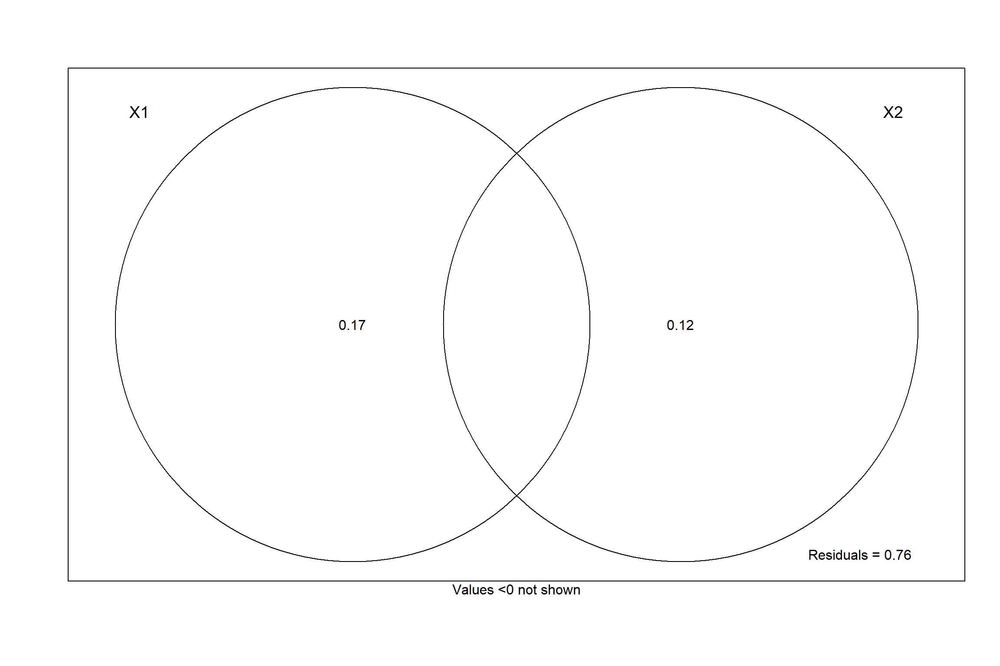
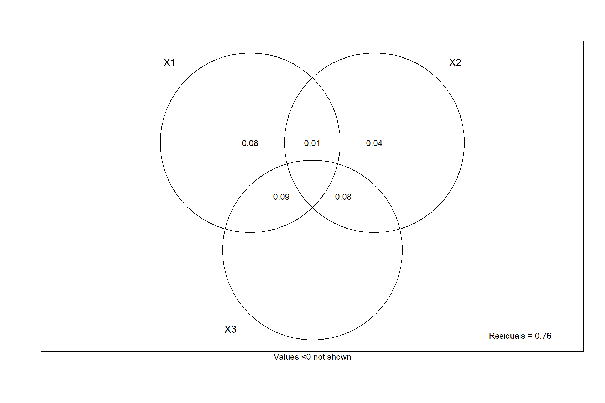

LabSea Protists
================
LabSea Slackers
2019-07-30

|                   | Coverage |
| ----------------- | -------: |
| DMS               |        1 |
| feeding\_strategy |        1 |
| motility          |        1 |
| Taille.um.        |        1 |

## Taxonomic

Permanova for taxonomical composition (sequencing) - Proportion of each
taxa (to compare with functional) loggit transformed
<!-- -->

    ## Permutation test for rda under reduced model
    ## Marginal effects of terms
    ## Permutation: free
    ## Number of permutations: 999
    ## 
    ## Model: rda(formula = com ~ cbind(dat$stationGrcentre, dat$stationGrgreenland) + dat$Year)
    ##                                                    Df Variance      F
    ## cbind(dat$stationGrcentre, dat$stationGrgreenland)  2 0.104356 2.3397
    ## dat$Year                                            2 0.085715 1.9217
    ## Residual                                           10 0.223013       
    ##                                                    Pr(>F)   
    ## cbind(dat$stationGrcentre, dat$stationGrgreenland)  0.006 **
    ## dat$Year                                            0.025 * 
    ## Residual                                                    
    ## ---
    ## Signif. codes:  0 '***' 0.001 '**' 0.01 '*' 0.05 '.' 0.1 ' ' 1

    ## Permutation test for rda under reduced model
    ## Permutation: free
    ## Number of permutations: 999
    ## 
    ## Model: rda(formula = com ~ cbind(dat$stationGrcentre, dat$stationGrgreenland) + dat$Year)
    ##          Df Variance      F Pr(>F)    
    ## Model     4  0.18797 2.1072  0.001 ***
    ## Residual 10  0.22301                  
    ## ---
    ## Signif. codes:  0 '***' 0.001 '**' 0.01 '*' 0.05 '.' 0.1 ' ' 1

<!-- -->

    ## Permutation test for rda under reduced model
    ## Marginal effects of terms
    ## Permutation: free
    ## Number of permutations: 999
    ## 
    ## Model: rda(formula = com ~ cbind(dat$stationGrcentre, dat$stationGrgreenland) + dat$DSP.4 + dat$Year)
    ##                                                    Df Variance      F
    ## cbind(dat$stationGrcentre, dat$stationGrgreenland)  2 0.071769 1.6025
    ## dat$DSP.4                                           1 0.021473 0.9589
    ## dat$Year                                            2 0.057314 1.2797
    ## Residual                                            9 0.201540       
    ##                                                    Pr(>F)  
    ## cbind(dat$stationGrcentre, dat$stationGrgreenland)  0.056 .
    ## dat$DSP.4                                           0.457  
    ## dat$Year                                            0.198  
    ## Residual                                                   
    ## ---
    ## Signif. codes:  0 '***' 0.001 '**' 0.01 '*' 0.05 '.' 0.1 ' ' 1

    ## Permutation test for rda under reduced model
    ## Permutation: free
    ## Number of permutations: 999
    ## 
    ## Model: rda(formula = com ~ cbind(dat$stationGrcentre, dat$stationGrgreenland) + dat$DSP.4 + dat$Year)
    ##          Df Variance      F Pr(>F)   
    ## Model     5  0.20945 1.8706  0.004 **
    ## Residual  9  0.20154                 
    ## ---
    ## Signif. codes:  0 '***' 0.001 '**' 0.01 '*' 0.05 '.' 0.1 ' ' 1

## Feeding strategy

  - Proportion of organism/trait loggit transformed
    <!-- -->

<!-- end list -->

    ## Permutation test for rda under reduced model
    ## Marginal effects of terms
    ## Permutation: free
    ## Number of permutations: 999
    ## 
    ## Model: rda(formula = com ~ cbind(dat$stationGrcentre, dat$stationGrgreenland) + dat$Year)
    ##                                                    Df Variance      F
    ## cbind(dat$stationGrcentre, dat$stationGrgreenland)  2 0.013736 5.1965
    ## dat$Year                                            2 0.012239 4.6300
    ## Residual                                           10 0.013217       
    ##                                                    Pr(>F)   
    ## cbind(dat$stationGrcentre, dat$stationGrgreenland)  0.003 **
    ## dat$Year                                            0.008 **
    ## Residual                                                    
    ## ---
    ## Signif. codes:  0 '***' 0.001 '**' 0.01 '*' 0.05 '.' 0.1 ' ' 1

    ## Permutation test for rda under reduced model
    ## Permutation: free
    ## Number of permutations: 999
    ## 
    ## Model: rda(formula = com ~ cbind(dat$stationGrcentre, dat$stationGrgreenland) + dat$Year)
    ##          Df Variance     F Pr(>F)   
    ## Model     4 0.022410 4.239  0.004 **
    ## Residual 10 0.013217                
    ## ---
    ## Signif. codes:  0 '***' 0.001 '**' 0.01 '*' 0.05 '.' 0.1 ' ' 1

<!-- -->

    ## Permutation test for rda under reduced model
    ## Marginal effects of terms
    ## Permutation: free
    ## Number of permutations: 999
    ## 
    ## Model: rda(formula = com ~ cbind(dat$stationGrcentre, dat$stationGrgreenland) + dat$DSP.4 + dat$Year)
    ##                                                    Df  Variance      F
    ## cbind(dat$stationGrcentre, dat$stationGrgreenland)  2 0.0065658 2.3071
    ## dat$DSP.4                                           1 0.0004101 0.2882
    ## dat$Year                                            2 0.0074815 2.6288
    ## Residual                                            9 0.0128068       
    ##                                                    Pr(>F)  
    ## cbind(dat$stationGrcentre, dat$stationGrgreenland)  0.097 .
    ## dat$DSP.4                                           0.771  
    ## dat$Year                                            0.067 .
    ## Residual                                                   
    ## ---
    ## Signif. codes:  0 '***' 0.001 '**' 0.01 '*' 0.05 '.' 0.1 ' ' 1

    ## Permutation test for rda under reduced model
    ## Permutation: free
    ## Number of permutations: 999
    ## 
    ## Model: rda(formula = com ~ cbind(dat$stationGrcentre, dat$stationGrgreenland) + dat$DSP.4 + dat$Year)
    ##          Df Variance      F Pr(>F)  
    ## Model     5 0.022821 3.2074  0.016 *
    ## Residual  9 0.012807                
    ## ---
    ## Signif. codes:  0 '***' 0.001 '**' 0.01 '*' 0.05 '.' 0.1 ' ' 1

## Classes de taille

### Sequencage

    ## png 
    ##   2

<!-- -->

    ## Permutation test for rda under reduced model
    ## Marginal effects of terms
    ## Permutation: free
    ## Number of permutations: 999
    ## 
    ## Model: rda(formula = com ~ cbind(dat$stationGrcentre, dat$stationGrgreenland) + dat$Year)
    ##                                                    Df Variance      F
    ## cbind(dat$stationGrcentre, dat$stationGrgreenland)  2 0.026110 4.1355
    ## dat$Year                                            2 0.023784 3.7671
    ## Residual                                           10 0.031568       
    ##                                                    Pr(>F)   
    ## cbind(dat$stationGrcentre, dat$stationGrgreenland)  0.006 **
    ## dat$Year                                            0.012 * 
    ## Residual                                                    
    ## ---
    ## Signif. codes:  0 '***' 0.001 '**' 0.01 '*' 0.05 '.' 0.1 ' ' 1

    ## Permutation test for rda under reduced model
    ## Permutation: free
    ## Number of permutations: 999
    ## 
    ## Model: rda(formula = com ~ cbind(dat$stationGrcentre, dat$stationGrgreenland) + dat$Year)
    ##          Df Variance      F Pr(>F)   
    ## Model     4 0.046752 3.7024  0.003 **
    ## Residual 10 0.031568                 
    ## ---
    ## Signif. codes:  0 '***' 0.001 '**' 0.01 '*' 0.05 '.' 0.1 ' ' 1

<!-- -->

    ## Permutation test for rda under reduced model
    ## Marginal effects of terms
    ## Permutation: free
    ## Number of permutations: 999
    ## 
    ## Model: rda(formula = com ~ cbind(dat$stationGrcentre, dat$stationGrgreenland) + dat$DSP.4 + dat$Year)
    ##                                                    Df  Variance      F
    ## cbind(dat$stationGrcentre, dat$stationGrgreenland)  2 0.0164149 2.5170
    ## dat$DSP.4                                           1 0.0022206 0.6810
    ## dat$Year                                            2 0.0121683 1.8658
    ## Residual                                            9 0.0293478       
    ##                                                    Pr(>F)  
    ## cbind(dat$stationGrcentre, dat$stationGrgreenland)  0.055 .
    ## dat$DSP.4                                           0.563  
    ## dat$Year                                            0.145  
    ## Residual                                                   
    ## ---
    ## Signif. codes:  0 '***' 0.001 '**' 0.01 '*' 0.05 '.' 0.1 ' ' 1

    ## Permutation test for rda under reduced model
    ## Permutation: free
    ## Number of permutations: 999
    ## 
    ## Model: rda(formula = com ~ cbind(dat$stationGrcentre, dat$stationGrgreenland) + dat$DSP.4 + dat$Year)
    ##          Df Variance      F Pr(>F)  
    ## Model     5 0.048973 3.0037  0.011 *
    ## Residual  9 0.029348                
    ## ---
    ## Signif. codes:  0 '***' 0.001 '**' 0.01 '*' 0.05 '.' 0.1 ' ' 1

    ## png 
    ##   2

## Motilité

### Seq

<!-- -->

    ## Permutation test for rda under reduced model
    ## Marginal effects of terms
    ## Permutation: free
    ## Number of permutations: 999
    ## 
    ## Model: rda(formula = com ~ cbind(dat$stationGrcentre, dat$stationGrgreenland) + dat$Year)
    ##                                                    Df Variance      F
    ## cbind(dat$stationGrcentre, dat$stationGrgreenland)  2 0.014159 6.1808
    ## dat$Year                                            2 0.011632 5.0777
    ## Residual                                           10 0.011454       
    ##                                                    Pr(>F)  
    ## cbind(dat$stationGrcentre, dat$stationGrgreenland)  0.013 *
    ## dat$Year                                            0.031 *
    ## Residual                                                   
    ## ---
    ## Signif. codes:  0 '***' 0.001 '**' 0.01 '*' 0.05 '.' 0.1 ' ' 1

    ## Permutation test for rda under reduced model
    ## Permutation: free
    ## Number of permutations: 999
    ## 
    ## Model: rda(formula = com ~ cbind(dat$stationGrcentre, dat$stationGrgreenland) + dat$Year)
    ##          Df Variance      F Pr(>F)  
    ## Model     4 0.022384 4.8856  0.022 *
    ## Residual 10 0.011454                
    ## ---
    ## Signif. codes:  0 '***' 0.001 '**' 0.01 '*' 0.05 '.' 0.1 ' ' 1

<!-- -->

    ## Permutation test for rda under reduced model
    ## Marginal effects of terms
    ## Permutation: free
    ## Number of permutations: 999
    ## 
    ## Model: rda(formula = com ~ cbind(dat$stationGrcentre, dat$stationGrgreenland) + dat$DSP.4 + dat$Year)
    ##                                                    Df  Variance      F
    ## cbind(dat$stationGrcentre, dat$stationGrgreenland)  2 0.0073527 2.8932
    ## dat$DSP.4                                           1 0.0000179 0.0140
    ## dat$Year                                            2 0.0061072 2.4031
    ## Residual                                            9 0.0114362       
    ##                                                    Pr(>F)  
    ## cbind(dat$stationGrcentre, dat$stationGrgreenland)  0.094 .
    ## dat$DSP.4                                           0.938  
    ## dat$Year                                            0.136  
    ## Residual                                                   
    ## ---
    ## Signif. codes:  0 '***' 0.001 '**' 0.01 '*' 0.05 '.' 0.1 ' ' 1

    ## Permutation test for rda under reduced model
    ## Permutation: free
    ## Number of permutations: 999
    ## 
    ## Model: rda(formula = com ~ cbind(dat$stationGrcentre, dat$stationGrgreenland) + dat$DSP.4 + dat$Year)
    ##          Df Variance      F Pr(>F)  
    ## Model     5 0.022402 3.5259  0.043 *
    ## Residual  9 0.011436                
    ## ---
    ## Signif. codes:  0 '***' 0.001 '**' 0.01 '*' 0.05 '.' 0.1 ' ' 1

## DMS

### Sequencage

    ## 
    ## Call:
    ## adonis(formula = com_prop.logit ~ Year * stationGr, data = samdf_agg[rownames(transect_seq_agg),      ], permutations = 999, method = "bray") 
    ## 
    ## Permutation: free
    ## Number of permutations: 999
    ## 
    ## Terms added sequentially (first to last)
    ## 
    ##                Df SumsOfSqs  MeanSqs F.Model      R2 Pr(>F)  
    ## Year            2   0.14384 0.071922  4.0785 0.45216  0.055 .
    ## stationGr       2   0.01393 0.006967  0.3951 0.04380  0.704  
    ## Year:stationGr  3   0.03691 0.012302  0.6976 0.11601  0.590  
    ## Residuals       7   0.12344 0.017635         0.38803         
    ## Total          14   0.31813                  1.00000         
    ## ---
    ## Signif. codes:  0 '***' 0.001 '**' 0.01 '*' 0.05 '.' 0.1 ' ' 1

    ## 
    ## Call:
    ## adonis(formula = com_prop.logit + abs(min(com_prop.logit)) ~      DSP.4 + chla.Peak + Year * stationGr, data = samdf_agg[rownames(com_prop),      ], permutations = 9999, method = "bray") 
    ## 
    ## Permutation: free
    ## Number of permutations: 9999
    ## 
    ## Terms added sequentially (first to last)
    ## 
    ##                Df SumsOfSqs  MeanSqs F.Model      R2 Pr(>F)  
    ## DSP.4           1   0.01715 0.017148  1.1797 0.05390 0.3217  
    ## chla.Peak       1   0.00011 0.000114  0.0079 0.00036 0.9293  
    ## Year            2   0.14560 0.072799  5.0081 0.45767 0.0570 .
    ## stationGr       2   0.00458 0.002289  0.1575 0.01439 0.8578  
    ## Year:stationGr  3   0.07801 0.026003  1.7888 0.24521 0.2518  
    ## Residuals       5   0.07268 0.014536         0.22847         
    ## Total          14   0.31813                  1.00000         
    ## ---
    ## Signif. codes:  0 '***' 0.001 '**' 0.01 '*' 0.05 '.' 0.1 ' ' 1

    ## Permutation test for rda under reduced model
    ## Permutation: free
    ## Number of permutations: 999
    ## 
    ## Model: rda(X = com, Y = cbind(dat$DSP.4), Z = cbind(dat$Year, dat$stationGrcentre, dat$stationGrgreenland))
    ##          Df  Variance      F Pr(>F)
    ## Model     1 0.0000193 0.0196  0.912
    ## Residual 10 0.0098254

    ## Permutation test for rda under reduced model
    ## Permutation: free
    ## Number of permutations: 999
    ## 
    ## Model: rda(X = com, Y = cbind(dat$stationGrcentre, dat$stationGrgreenland), Z = cbind(dat$DSP.4, dat$Year))
    ##          Df  Variance      F Pr(>F)
    ## Model     2 0.0009065 0.4613  0.676
    ## Residual 10 0.0098254

    ## Permutation test for rda under reduced model
    ## Permutation: free
    ## Number of permutations: 999
    ## 
    ## Model: rda(X = com, Y = cbind(dat$Year), Z = cbind(dat$DSP.4, dat$stationGrcentre, dat$stationGrgreenland))
    ##          Df  Variance      F Pr(>F)  
    ## Model     1 0.0068865 7.0089  0.028 *
    ## Residual 10 0.0098254                
    ## ---
    ## Signif. codes:  0 '***' 0.001 '**' 0.01 '*' 0.05 '.' 0.1 ' ' 1

    ## Permutation test for rda under reduced model
    ## Permutation: free
    ## Number of permutations: 999
    ## 
    ## Model: rda(X = com, Y = cbind(dat$stationGrcentre, dat$stationGrgreenland, dat$DSP.4, dat$Year))
    ##          Df  Variance      F Pr(>F)
    ## Model     4 0.0099140 2.5226    0.1
    ## Residual 10 0.0098254

<!-- -->
